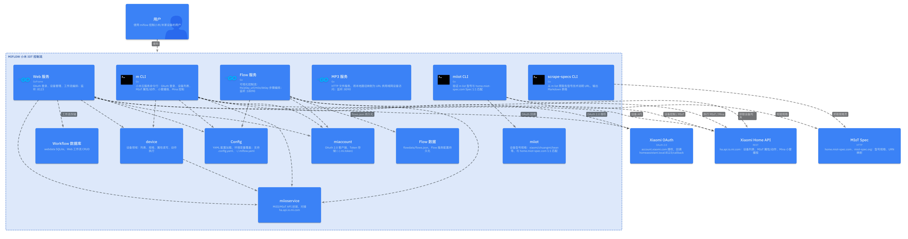

# miflow

小米米家 IOT 设备自定义控制流，提供命令行，web界面和接口用于外部调用。



## 使用方式

`make b` 构建之后，配置域名解析，将 `homeassistant.local` [解析到本机](docs/host.md)，启动`miflow-web`进程。

访问 [http://homeassistant.local:8123/](http://homeassistant.local:8123/)，使用小米账号登录后，Token 会保存在 `~/.mi.token`。

## 命令行用法

使用命令需要先登录获取米家账户token。

- **设备列表**  
  `m list`  
  `m list full true 0`

- **MIoT 属性**  
  查: `m 1,1-2,2-1`  
  设: `m 2=#60,2-2=#false`

- **MIoT 动作**  
  `m 5 你好`  
  `m 5-4 查询天气 #1`

- **小爱播报**（需设置 `MI_DID`）  
  `m message 你好`  
  `m mina`  # 查看当前设备信息

- **MIoT 规格**  
  `m spec speaker`  
  `m spec xiaomi.wifispeaker.lx04`

- **帮助**  
  `m help` 或 `m ?`

### 与 ha_xiaomi_home 的对应关系

| 功能     | ha_xiaomi_home     | miflow         |
|----------|--------------------|-----------------|
| 登录方式 | OAuth 2.0          | OAuth 2.0      |
| API 域名 | ha.api.io.mi.com   | ha.api.io.mi.com |
| 设备列表 | device_list_page   | m list         |
| 属性读写 | miotspec/prop      | m siid,piid=val |
| 动作执行 | miotspec/action    | m siid-aiid args |
| 小爱播报 | Execute Text Directive | m message    |

### 环境变量


配置优先级：**环境变量 > 配置文件 > 默认值**。

```bash
export MI_DID=<设备ID或名称>   # 部分命令需要，也可在配置 default_did
export MI_DEBUG=1              # 可选，打印 HTTP 请求/响应（调试用），或配置 debug: true
```